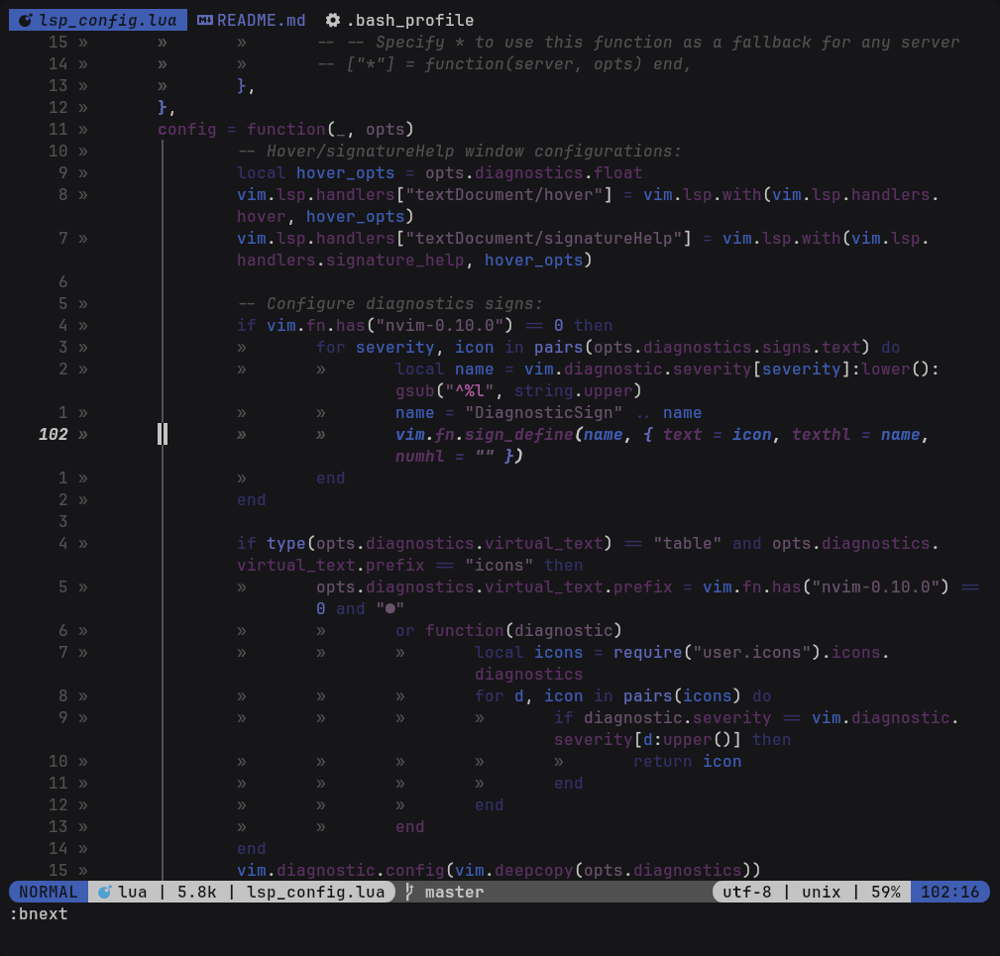
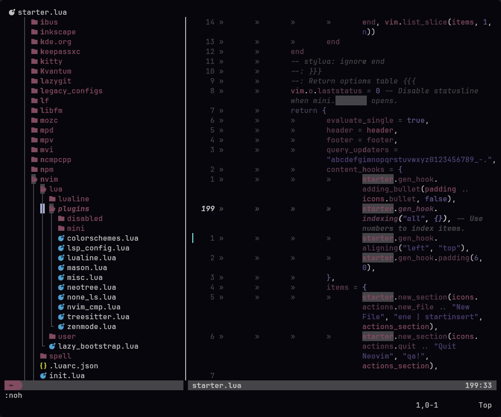

# Neopywal.nvim

**Neopywal.nvim** is an improved and maintained version of [pywal.nvim](https://github.com/AlphaTechnolog/pywal.nvim), which on itself was a updated version of [wal.vim](https://github.com/dylanaraps/wal.vim).

**Neopywal** offers lots of additional features when compared to it's predecessor, such as:

- Enhanced plugin support.
- Improved coloring for a variety of file formats.
- Ability to change default color definitions.
- Ability to change pre-defined highlight groups.

## Screenshots





## Supported plugins:

- [Netrw](https://www.vim.org/scripts/script.php?script_id=1075)
- [Lazy.nvim](https://github.com/folke/lazy.nvim)
- [Coc](https://github.com/neoclide/coc.nvim)
- [Ale](https://github.com/dense-analysis/ale)
- [GitGutter](https://github.com/airblade/vim-gitgutter)
- [Nvim-cmp](https://github.com/hrsh7th/nvim-cmp)
- [Nvim-lspconfig](https://github.com/neovim/nvim-lspconfig)
- [Nvim-treesitter](https://github.com/nvim-treesitter/nvim-treesitter)
- [Neo-tree](https://github.com/nvim-neo-tree/neo-tree.nvim)
- [BufferLine](https://github.com/akinsho/bufferline.nvim)
- [Which-key](https://github.com/folke/which-key.nvim)
- [Dashboard-nvim](https://github.com/nvimdev/dashboard-nvim)
- [Alpha-nvim](https://github.com/goolord/alpha-nvim)
- [Indent-blankline](https://github.com/lukas-reineke/indent-blankline.nvim)
- [Undotree](https://github.com/mbbill/undotree)
- [Telescope](https://github.com/nvim-telescope/telescope.nvim)
- [Feline](https://github.com/freddiehaddad/feline.nvim)
- [Lualine](https://github.com/nvim-lualine/lualine.nvim)
- [Gitsigns](https://github.com/lewis6991/gitsigns.nvim)

As well as many of [mini.nvim](https://github.com/echasnovski/mini.nvim) plugins, such as:

- [Mini.indentscope](https://github.com/echasnovski/mini.indentscope)
- [Mini.statusline](https://github.com/echasnovski/mini.statusline)
- [Mini.tabline](https://github.com/echasnovski/mini.tabline)
- [Mini.starter](https://github.com/echasnovski/mini.starter)
- [Mini.cursorword](https://github.com/echasnovski/mini.cursorword)
- [Mini.files](https://github.com/echasnovski/mini.files)
- [Mini.hipatterns](https://github.com/echasnovski/mini.hipatterns)
- [Mini.pick](https://github.com/echasnovski/mini.pick)

## Improved File Formats

- C/C++/C#
- Clojure
- Cmake
- Common lisp
- Css
- Dart
- Diff
- Elixir
- Erlang
- Git commit
- Go
- Haskell
- Help
- Html
- Ini
- Java
- Javascript
- Javascript React
- Json
- Kotlin
- Latex
- Less
- Lua
- Makefile
- Markdown
- Matlab
- ObjectiveC
- Ocaml
- Perl
- Php
- Powershell
- Python
- ReStructuredText
- Ruby
- Rust
- Sass
- Scala
- Shell
- Swift
- Toml
- Typescript
- VimL
- Xml
- Yaml
- Zsh

> Honestly with this alone you could ditch treesitter xd.

## Installation

You can install this plugin with the following plugin managers:

[lazy.nvim](https://github.com/folke/lazy.nvim)

```lua
require("lazy").setup({
    {
        "RedsXDD/neopywal.nvim",
        name = "neopywal",
        lazy = false,
        priority = 1000,
        opts = {},
    },
})
```

[packer.nvim](https://github.com/wbthomason/packer.nvim)

```lua
use { "RedsXDD/neopywal.nvim", as = 'neopywal' }
```

[vim-plug](https://github.com/junegunn/vim-plug)

```vim
Plug 'RedsXDD/neopywal.nvim', { 'as': 'neopywal' }
```

## Activate theme

To activate the theme, call this in your neovim config:

```lua
local neopywal = require("neopywal")
neopywal.setup()
vim.cmd.colorscheme("neopywal")
```

Or with vim script:

```vim
colorscheme neopywal
```

> [!Note]
> The colorscheme will automatically set the `vim.opt.termguicolors` option to true

## Activating lualine theme

Place this in your lualine config:

```lua
local lualine = require("lualine")

lualine.setup {
    options = {
        theme = "neopywal",
    },
}
```

## Activating bufferline theme

> [!NOTE]
> Bufferline needs to be loaded after setting up neopywal or it will highlight incorrectly.

```lua
config = function()
    require("bufferline").setup({
        highlights = require("neopywal.bufferline").setup()
    })
end
```

Overriding configurations can be done inside the setup() function, see `:h bufferline-highlights` for detailed explanations:

```lua
local colors = require("neopywal").get_colors()
bufferline.setup({
    highlights = require("neopywal.bufferline").setup({
        fill = { bg = colors.color1 },
        background = { fg = "#00ff00" },
    })
})
```

## Activating the feline theme (untested with Neopywal)

You can put this to your config to activate the feline config:

```lua
local has_feline, feline = pcall(require, "feline")
if not has_feline then
    return
end

local has_neopywal, neopywal = pcall(require, "neopywal.feline")
if not has_neopywal then
    return
end

feline.setup({
    components = neopywal,
})
```

Then you should see the feline bar working successfully.

## Configuration

There is no need to call `setup` if you don't want to change the default options and settings.

```lua
require("neopywal").setup({
    -- Uses a template file `~/.cache/wallust/colors_neopywal.vim` instead of the regular
    -- pywal template at `~/.cache/wal/colors-wal.vim`
    use_wallust = false,

    -- Sets the background color of certain highlight groups to be transparent.
    -- Use this when your terminal opacity is < 1.
    transparent_background = false,

    -- With this option you can overwrite all the base colors the colorscheme uses.
    custom_colors = {},

    -- With this option you can overwrite any highlight groups set by the colorscheme.
    custom_highlights = {},

    -- Dims the background when another window is focused.
    dim_inactive = true,

	-- Apply colorscheme for Neovim's terminal (e.g. `g:terminal_color_0`).
    terminal_colors = true,

    -- Shows the '~' characters after the end of buffers.
    show_end_of_buffer = false,

	no_italic = false, -- Force no italic.
	no_bold = false, -- Force no bold.
	no_underline = false, -- Force no underline.
	no_undercurl = false, -- Force no undercurl.
	no_strikethrough = false, -- Force no strikethrough.

	-- Handles the styles of general hi groups (see `:h highlight-args`).
	styles = {
		comments = { "italic" },
		conditionals = { "italic" },
		loops = {},
		functions = {},
		keywords = {},
		includes = { "italic" },
		strings = {},
		variables = { "italic" },
		numbers = {},
		booleans = {},
		-- properties = {},
		types = { "italic" },
		operators = {},
	},

    -- Setting this to false disables all default file format highlights.
    -- Useful if you want to enable specific file format options.
    default_fileformats = true,

    -- Setting this to false disables all default plugin highlights.
    -- Useful if you want to enable specific plugin options.
    default_plugins = true,

    fileformats = {
        c_cpp = true,
        clojure = true,
        cmake = true,
        git_commit = true,
        c_sharp = true,
        css = true,
        dart = true,
        diff = true,
        elixir = true,
        erlang = true,
        go = true,
        haskell = true,
        help = true,
        html = true,
        ini = true,
        java = true,
        json = true,
        javascript_react = true,
        javascript = true,
        kotlin = true,
        latex = true,
        less = true,
        common_lisp = true,
        lua = true,
        makefile = true,
        markdown = true,
        matlab = true,
        objectivec = true,
        ocaml = true,
        perl = true,
        php = true,
        powershell = true,
        python = true,
        restructuredtext = true,
        ruby = true,
        rust = true,
        sass = true,
        scala = true,
        shell = true,
        swift = true,
        toml = true,
        typescript = true,
        viml = true,
        xml = true,
        yaml = true,
        zsh = true,
    },

    plugins = {
        ale = true,
        alpha = true,
        nvim_cmp = true,
        lazygit = true,
        coc = true,
        dashboard = true,
        git_gutter = true,
        indent_blankline = true,
        lazy = true,
        lspconfig = true,
        neotree = true,
        netrw = true,
        telescope = true,
        treesitter = true,
        undotree = true,
        which_key = true,
        mini = {
            cursorword = true,
            files = true,
            hipatterns = true,
            indentscope = true,
            pick = true,
            starter = true,
            statusline = true,
            tabline = true,
        },
    },
})
```

## Customizing colors

Color definitions can be overwritten using the `custom_colors` option, for example:

```lua
require("neopywal").setup({
    -- Here's an example color template for the catppuccin colorscheme:
    custom_colors = {
        background = "#1E1E2E",
        foreground = "#CDD6F4",
        cursor = "#F5E0DC",
        color0 = "#45475A",
        color1 = "#F38BA8",
        color2 = "#A6E3A1",
        color3 = "#F9E2AF",
        color4 = "#89B4FA",
        color5 = "#F5C2E7",
        color6 = "#94E2D5",
        color7 = "#BAC2DE",
        color8 = "#585B70",
        color9 = "#F38BA8",
        color10 = "#A6E3A1",
        color11 = "#F9E2AF",
        color12 = "#89B4FA",
        color13 = "#F5C2E7",
        color14 = "#94E2D5",
        color15 = "#A6ADC8",
    },
})
```

You can also define your own color variables, for example:

```lua
require("neopywal").setup({
    custom_colors = {
        red = "#ff0000"
        green = "#00ff00"
        blue = "#0000ff"
    },
})
```

Custom color variables are gonna be automatically exported with the `get_colors()` function and can used normally when using it to import a colors dictionary.

## Customizing highlight groups.

Highlight groups can be overwritten using `custom_highlights` option, for example:

```lua
require("neopywal").setup({
    custom_highlights = function(colors)
        return {
            Comment = { fg = colors.color3 }
            TabLineSel = { bg = colors.color5 },
            FloatBorder = { bg = colors.color1 },
            Pmenu = { bg = colors.color6 },
        }
    end
})
```

Neopywal also allows the user to set transparency for highlight groups using either the `transparent` or the `none` color variables, for example:

```lua
require("neopywal").setup({
    custom_highlights = function (colors)
        return {
            Normal = { bg = colors.none }, -- `bg = colors.transparent` has the same effect.
        }
    end
})
```

## Importing colors

You can use the function `get_colors()` if you want to import the colors into a lua dictionary:

```lua
local colors = require("neopywal").get_colors()
```

This will import the following colors dictionary:

```lua
background -- Main background color.
foreground -- Main foreground color.
color0     -- Black.
color1     -- Red.
color2     -- Green.
color3     -- Yellow.
color4     -- Blue.
color5     -- Magenta.
color6     -- Cyan.
color7     -- Bright white.
color8     -- Bright black.
color9     -- Bright red.
color10    -- Bright green.
color11    -- Bright yellow.
color12    -- Bright blue.
color13    -- Bright magenta.
color14    -- Bright cyan.
color15    -- Bright white.
none/transparent -- Use one of these keywords for transparency.
```

Then you can apply the colors in a way similar to the one found in `custom_highlights = {}`

### Example

```lua
local colors = require("neopywal").get_colors()

return {
    color_var1 = { colors.color1 }
    color_var2 = { colors.color2 }
    color_var3 = { colors.color3 }
}
```

## Improving imported colors

There's a neat set of functions inside `util.lua`, such as:

```lua
require("neopywal.util").darken(color, factor)
require("neopywal.util").lighten(color, factor)
require("neopywal.util").blend(color1, color2, factor)
```

The `darken()` and `lighten()` functions are able to create new colors by darkening/lightening existing colors. Both functions take two parameters, the first one is the color you want to modify, the second is an integer that defines how much each color will be darken/lighten.

### Example

```lua
local colors = require("neopywal").get_colors()
local U = require("neopywal.util")

color_var1 = { U.lighten(colors.color1, 30) }
color_var2 = { U.darken(colors.color2, 30) }
```

The `blend()` function combines two colors to create a new color that is a mixture of the two input colors. The function takes three parameters:

* The first two parameters define the colors to be blended.
* The third `factor` parameter is a number between 0 and 1 that determines the proportion of each color in the final output.

### Example

In this example:

* `color_var1` will be identical to `colors.color1`.
* `color_var2` will be identical to `colors.color3`.
* `color_var3` will be a 50/50 mix of `colors.color1` and `colors.color3`.

```lua
local colors = require("neopywal").get_colors()
local U = require("neopywal.util")

color_var1 = { U.darken(colors.color1, colors.color3, 0) }
color_var2 = { U.darken(colors.color1, colors.color3, 1) }
color_var3 = { U.blend(colors.color1, colors.color3, 0.5) }
```

> [!Note]
> All color parameters on util.lua functions have to be in hexadecimal format.

## How it works

Pywal automatically generates a file called `colors-wal.vim` in `~/.cache/wal/colors-wal.vim`, the file contains all the colors variables that are necessary to create a color dictionary that can be used to generate a Neovim colorscheme. The file looks like this:

```vim
" Special
let wallpaper  = "/home/user/Pictures/wallpaper.png"
let background = "#1E1E2E"
let foreground = "#CDD6F4"
let cursor     = "#F5E0DC"

" Colors
let color0  = "#45475A"
let color1  = "#F38BA8"
let color2  = "#A6E3A1"
let color3  = "#F9E2AF"
let color4  = "#89B4FA"
let color5  = "#F5C2E7"
let color6  = "#94E2D5"
let color7  = "#BAC2DE"
let color8  = "#585B70"
let color9  = "#F38BA8"
let color10 = "#A6E3A1"
let color11 = "#F9E2AF"
let color12 = "#89B4FA"
let color13 = "#F5C2E7"
let color14 = "#94E2D5"
let color15 = "#A6ADC8"
```

> [!Note]
> As April 26, 2024 Pywal is officially deprecated, so it's not recommended to use it (even tho you can).

One idea to mitigate that problem would be to use a fork that's feature compatible with pywal, or that at very least exports the same color variables that are necessary for this plugin to work. There are two projects that i personally recommend as a pywal replacement:

- [pywal16](https://github.com/eylles/pywal16) by [ellyes](https://github.com/eylles)
- [wallust](https://codeberg.org/explosion-mental/wallust) by [explosion-mental](https://codeberg.org/explosion-mental)

Pywal16 is a drop-in replacement for pywal, so no extra work has to be done.
Wallust requires some tweaking however, but it's not complicated to make it work.

## Setting up Wallust with Neopywal

After installing wallust, you will need to create two files. The first is a template file that should be located on `~/.config/wallust/templates/colors_neopywal.vim`, the second is the default configuration file for wallust, which should be created at `~/.config/wallust/wallust.toml`.

Here are the contents that should be copied of to them:

`colors_neopywal.vim`
```vim
let background = "{{background}}"
let foreground = "{{foreground}}"
let cursor     = "{{cursor}}"

let color0  = "{{color0}}"
let color1  = "{{color1}}"
let color2  = "{{color2}}"
let color3  = "{{color3}}"
let color4  = "{{color4}}"
let color5  = "{{color5}}"
let color6  = "{{color6}}"
let color7  = "{{color7}}"
let color8  = "{{color8}}"
let color9  = "{{color9}}"
let color10 = "{{color10}}"
let color11 = "{{color11}}"
let color12 = "{{color12}}"
let color13 = "{{color13}}"
let color14 = "{{color14}}"
let color15 = "{{color15}}"
```

`wallust.toml`
```toml
neopywal.template = "templates/colors_neopywal.vim"
neopywal.target = "~/.cache/wallust/colors_neopywal.vim"
```

After that you need to enable the `use_wallust` option on you Neopywal configuration.

```lua
require("neopywal").setup({
    use_wallust = true,
})
```

Enabling this option makes Neopywal automatically read the template file that will be generated by Wallust on `~/.cache/wallust/colors_neopywal.vim`, and with that Neopywal should work exactly the same as if you were using Pywal.

## Enjoy ⭐

If you like this work you can give it a star :)
