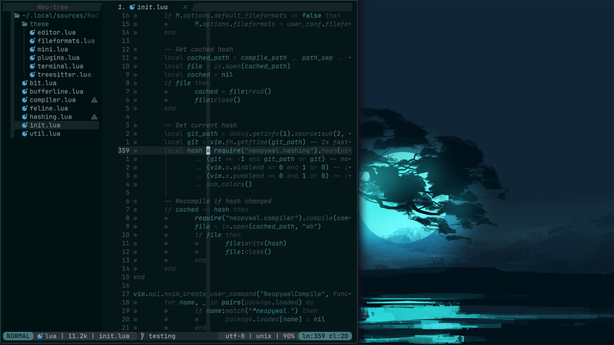
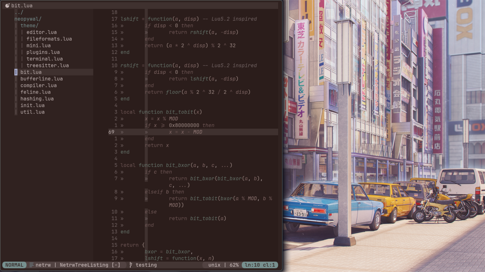
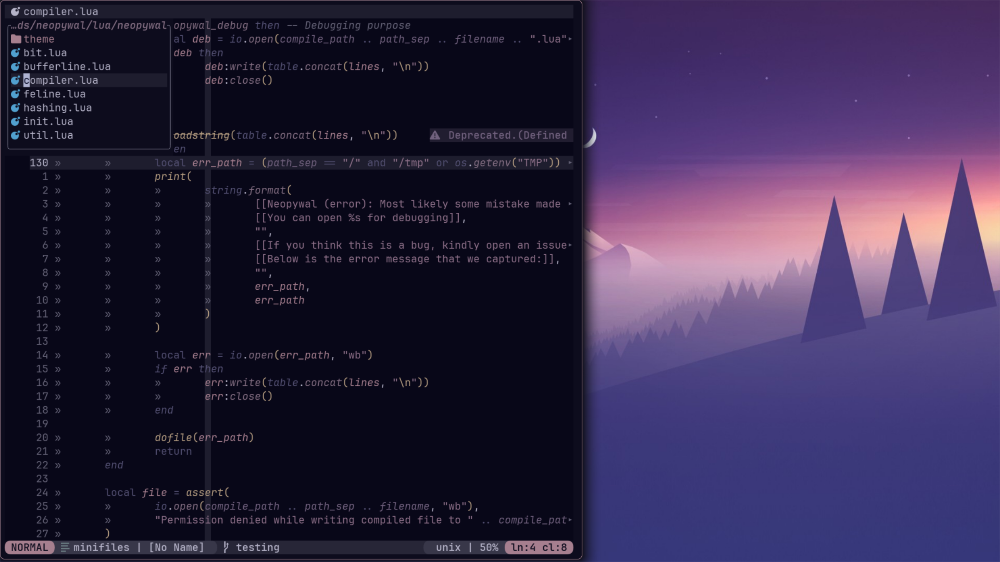

<!-- panvimdoc-ignore-start -->

<h1 align="center">
    🎨 (Neo)pywal for <a href="https://github.com/neovim/neovim">(Neo)</a><a href="https://github.com/vim/vim">vim</a>
</h1>

<p align="center">
    <b>Neopywal.nvim</b> is a Neovim colorscheme plugin that automatically fetches and applies the colors that are auto generated by <a href="https://github.com/dylanaraps/pywal">Pywal</a>. It also is an improved and maintained version of <a href="https://github.com/AlphaTechnolog/pywal.nvim">Pywal.nvim</a>, which aimed to be an updated version of <a href="https://github.com/dylanaraps/wal.vim">wal.vim</a>.
</p>

> [!Note]
> As April 26, 2024, [Pywal](https://github.com/dylanaraps/pywal) is officially deprecated, so it's not recommended to use it.
> You can look for alternatives that will work with Neopywal.nvim on the section [Pywal Alternatives](#Pywal-Alternatives).


\

\

\


<!-- panvimdoc-ignore-end -->

<!-- Table of Contents {{{ -->

<!-- panvimdoc-ignore-start -->

## Table of Contents

1. [Features](#Features)
2. [Installation](#Installation)
3. [Usage](#Usage)
   1. [Alternative Variants](#Alternative-Variants)
   2. [Note on Light Theme](#Note-on-Light-Theme)
4. [Configuration](#Configuration)
   1. [Customizing Colors](#Customizing-Colors)
   2. [Customizing Highlights](#Customizing-Highlights)
   3. [Fileformats](#Fileformats)
   4. [Plugins](#Plugins)
5. [Compilation](#Compilation)
6. [Importing Colors](#Importing-Colors)
7. [Utilities](#Utilities)
   1. [The Darken and Lighten Functions](#The-Darken-and-Lighten-Functions)
   2. [The Blend Function](#The-Blend-Function)
8. [Pywal Alternatives](#Pywal-Alternatives)
   1. [Setting up Wallust](#Setting-up-Wallust)
9. [How it Works](#How-it-Works)
10. [Enjoy](#Enjoy)

<!-- panvimdoc-ignore-end -->

<!-- }}} -->
<!-- Features {{{ -->

## Features

- Highly configurable with ability to change color definitions and highlight groups.
- True color support.
- Export table with color palette.
- Fail safe color fallbacks if required palette files could not be loaded.
- Supports [Pywal](https://github.com/dylanaraps/pywal) and [Wallust](https://codeberg.org/explosion-mental/wallust).
- Support for LSP, treesitter and [a bunch of plugins](#Plugins).
- Enhanced syntax highlighting for [fileformats](#Fileformats) (without using treesitter).
- [Compiled](#Compilation) user's configuration for fast startup times.

<!-- }}} -->
<!-- Installation {{{ -->

## Installation

[lazy.nvim](https://github.com/folke/lazy.nvim)

```lua
{
    "RedsXDD/neopywal.nvim",
    name = "neopywal",
    lazy = false,
    priority = 1000,
    opts = {},
}
```

[packer.nvim](https://github.com/wbthomason/packer.nvim)

```lua
use { "RedsXDD/neopywal.nvim", as = 'neopywal' }
```

[vim-plug](https://github.com/junegunn/vim-plug)

```vim
Plug 'RedsXDD/neopywal.nvim', { 'as': 'neopywal' }
```

<!-- }}} -->
<!-- Usage {{{ -->

## Usage

To activate the theme, add the following to your Neovim config:

```lua
local neopywal = require("neopywal")
neopywal.setup()
vim.cmd.colorscheme("neopywal")
```

Or call the colorscheme with vim script:

```vim
colorscheme neopywal
```

### Alternative Variants

Neopywal can also take advantage of Neovim's `vim.o.background` option (see `:h background`) to dynamically adjust the color palette on the fly. This allows you to switch between a light and dark colorscheme, even when Pywal generates a dark palette.

```vim
colorscheme neopywal-dark
" or
colorscheme neopywal-light
```

Note that, by default, when loading the colorscheme with the standard `:colorscheme neopywal` command, Neopywal will automatically detect and load the corresponding colorscheme variant based on the current value of `vim.o.background`.

### Note on Light Theme

When loading the "light" theme variant, Neopywal **won't** generate any new colorscheme palette. Instead, it loads the existing palette (used by the `neopywal-dark` variant) and inverts the `background` and `foreground` color variables (see [Importing Colors](#Importing-Colors) for more information). This may not produce the best results when comparing to an actual auto generated light theme variant, but it's generally good enough.

To use a genuine light theme with Neopywal, generate a new colorscheme with Pywal while using the `-l` flag.

```sh
$ wal -l -i /path/to/your/image
```

> [!Note]
> Make sure to run `:colorscheme neopywal` or `vim.cmd.colorscheme("neopywal")`, otherwise the colorscheme won't be loaded.

<!-- }}} -->
<!-- Configuration {{{ -->

## Configuration

There is no need to call `setup` if you don't want to change the default options and settings.

```lua
require("neopywal").setup({
    -- Uses a template file `~/.cache/wallust/colors_neopywal.vim` instead of the regular
    -- Pywal template at `~/.cache/wal/colors-wal.vim`
    use_wallust = false,

    -- This option allows to specify where Neopywal should look for a ".vim" template file.
    colorscheme_file = "", -- e.g.: "~/.cache/wal/custom_neopywal_template.vim".

    -- Sets the background color of certain highlight groups to be transparent.
    -- Use this when your terminal opacity is < 1.
    transparent_background = false,

    -- With this option you can overwrite all the base colors the colorscheme uses.
    custom_colors = {},

    -- With this option you can overwrite any highlight groups set by the colorscheme.
    -- For more information scroll down (https://github.com/RedsXDD/neopywal.nvim#Customizing-Highlights)
    custom_highlights = {},

    -- Dims the background when another window is focused.
    dim_inactive = true,

    -- Apply colorscheme for Neovim's terminal (e.g. `g:terminal_color_0`).
    terminal_colors = true,

    -- Shows the '~' characters after the end of buffers.
    show_end_of_buffer = false,

    -- Shows the '|' split separator characters.
    -- It's worth noting that this options works better in conjunction with `dim_inactive`.
    show_split_lines = true,

    no_italic = false, -- Force no italic.
    no_bold = false, -- Force no bold.
    no_underline = false, -- Force no underline.
    no_undercurl = false, -- Force no undercurl.
    no_strikethrough = false, -- Force no strikethrough.

    -- Handles the styles of general hi groups (see `:h highlight-args`).
    styles = {
        comments = { "italic" },
        conditionals = { "italic" },
        loops = {},
        functions = {},
        keywords = {},
        includes = { "italic" },
        strings = {},
        variables = { "italic" },
        numbers = {},
        booleans = {},
        types = { "italic" },
        operators = {},
    },

    -- Setting this to false disables all default file format highlights.
    -- Useful if you want to enable specific file format options.
    -- NOTE: if the treesitter plugin integration is enabled, this option
    -- will be automatically set to false unless the user manually sets it back on
    -- using the setup() function.
    default_fileformats = true,

    -- Setting this to false disables all default plugin highlights.
    -- Useful if you want to enable specific plugin options.
    default_plugins = true,

    fileformats = {
        c_cpp = true,
        c_sharp = true,
        -- For more fileformats options please scroll down (https://github.com/RedsXDD/neopywal.nvim#Fileformats)
    },
    plugins = {
        alpha = true,
        coc = true,
        mini = {
            cursorword = true,
            files = true,
        },
        -- For more plugin options please scroll down (https://github.com/RedsXDD/neopywal.nvim#Plugins)
    },
})
```

<!-- }}} -->
<!-- Customizing Colors {{{ -->

### Customizing Colors

Color definitions can be overwritten using the `custom_colors` option:

```lua
require("neopywal").setup({
    -- Here's an example color template for the catppuccin colorscheme:
    custom_colors = {
        background = "#1E1E2E",
        foreground = "#CDD6F4",
        cursor = "#F5E0DC",
        color0 = "#45475A",
        color1 = "#F38BA8",
        color2 = "#A6E3A1",
        color3 = "#F9E2AF",
        color4 = "#89B4FA",
        color5 = "#F5C2E7",
        color6 = "#94E2D5",
        color7 = "#BAC2DE",
        color8 = "#585B70",
        color9 = "#F38BA8",
        color10 = "#A6E3A1",
        color11 = "#F9E2AF",
        color12 = "#89B4FA",
        color13 = "#F5C2E7",
        color14 = "#94E2D5",
        color15 = "#A6ADC8",
    },
})
```

You can also define your own color variables:

```lua
require("neopywal").setup({
    custom_colors = {
        red = "#ff0000"
        green = "#00ff00"
        blue = "#0000ff"
    },
})
```

Custom color variables will be automatically exported with the `get_colors()` function and can used normally when using the imported color palette.

<!-- }}} -->
<!-- Customizing Highlights {{{ -->

### Customizing Highlights

Highlight groups can be overwritten using `custom_highlights` option.

With an internal function:

```lua
require("neopywal").setup({
    custom_highlights = function(colors)
        return {
            Comment = { fg = colors.color3 }
            TabLineSel = { bg = colors.color5 },
            FloatBorder = { bg = colors.color1 },
            Pmenu = { bg = colors.color6 },
        }
    end
})
```

Using an externally exported color palette.

```lua
local colors = require("neopywal").get_colors()

require("neopywal").setup({
    custom_highlights = {
        Comment = { fg = colors.color3 }
        TabLineSel = { bg = colors.color5 },
        FloatBorder = { bg = colors.color1 },
        Pmenu = { bg = colors.color6 },
    }
})
```

Neopywal also allows to set a transparent color for highlight groups using the `none` color variable.

```lua
require("neopywal").setup({
    custom_highlights = function (colors)
        return {
            Normal = { bg = colors.none },
        }
    end
})
```

<!-- }}} -->
<!-- Fileformats {{{ -->

### Fileformats

Neopywal provides theme support for extra syntax highlighting groups that do not use treesitter. This is useful for users that don't have treesitter installed but still want a somewhat decent syntax highlighting.

Some fileformats are enabled by default, you can control this behaviour with the `default_fileformats` option.

```lua
require("neopywal").setup({
    default_fileformats = false,
})
```

To enable/disable a supported fileformat you just need to set it to true/false.

```lua
require("neopywal").setup({
    fileformats = {
        c_cpp = true,
        c_sharp = true,
        clojure = true,
        cmake = true,
        common_lisp = true,
        css = true,
        dart = true,
        diff = true,
        elixir = true,
        erlang = true,
        git_commit = true,
        go = true,
        haskell = true,
        help = true,
        html = true,
        ini = true,
        java = true,
        javascript = true,
        javascript_react = true,
        json = true,
        kotlin = true,
        latex = true,
        less = true,
        lua = true,
        makefile = true,
        markdown = true,
        matlab = true,
        objectivec = true,
        ocaml = true,
        perl = true,
        php = true,
        powershell = true,
        python = true,
        restructuredtext = true,
        ruby = true,
        rust = true,
        sass = true,
        scala = true,
        shell = true,
        swift = true,
        toml = true,
        typescript = true,
        viml = true,
        xml = true,
        yaml = true,
        zsh = true,
    }
})
```

<!-- }}} -->
<!-- Plugins {{{ -->

### Plugins

Neopywal also provides theme support for other plugins in the Neovim ecosystem. To enable/disable a plugin you just need to set it to true/false.

```lua
require("neopywal").setup({
    plugins = {
        alpha = true,
        dashboard = false,
        git_gutter = true,
        indent_blankline = true,
        lazy = true,
        lazygit = true,
        noice = false,
        notify = true,
        nvim_cmp = true,
        mini = {
            hipatterns = true,
            indentscope = false,
            pick = true,
            starter = true,
        },
    },
})
```

Some plugins are enabled by default, you can control this behaviour with the `default_plugins` option.

```lua
require("neopywal").setup({
    default_plugins = false,
})
```

Below is a list of supported plugins and their corresponding configuration module.

<table>
<tr>
<td> <b>Plugin</b> </td> <td> <b>Default</b> </td>
</tr>

<!-- alpha-nvim {{{ -->
<tr>
<td> <a href="https://github.com/goolord/alpha-nvim">alpha-nvim</a> </td>
<td>

```lua
alpha = true
```

</td>
</tr>
<!-- }}} -->
<!-- bufferline.nvim {{{ -->
<tr>
<td> <a href="https://github.com/akinsho/bufferline.nvim">bufferline.nvim</a> </td>
<td>

<details> <summary>Special</summary>

Update your bufferline config to use the Neopywal components:

> [!Note]
> Bufferline needs to be loaded after setting up Neopywal or it will highlight incorrectly.

Configuration for [packer.nvim](https://github.com/wbthomason/packer.nvim) users:

```lua
use "akinsho/bufferline.nvim" {
  after = "neopywal",
  config = function()
    require("bufferline").setup {
      highlights = require("neopywal.theme.plugins.bufferline").setup()
    }
  end
}
```

Configuration for [lazy.nvim](https://github.com/folke/lazy.nvim) users:

```lua
{
    "RedsXDD/neopywal.nvim",
    name = "neopywal",
    lazy = false,
    priority = 1000, -- Neopywal loads first because it has higher priority.
},
{
    "akinsho/bufferline.nvim",
    config = function()
        require("bufferline").setup({
            highlights = require("neopywal.theme.plugins.bufferline").setup()
        })
    end
}
```

Overriding configurations can be done inside the setup() function, see `:h bufferline-highlights` for detailed explanations:

```lua
local colors = require("neopywal").get_colors()
bufferline.setup({
    highlights = require("neopywal.theme.plugins.bufferline").setup({
        fill = { bg = colors.color1 },
        background = { fg = "#00ff00" },
    })
})
```

</details>

</td>
</tr>
<!-- }}} -->
<!-- coc.nvim {{{ -->
<tr>
<td> <a href="https://github.com/neoclide/coc.nvim">coc.nvim</a> </td>
<td>

```lua
coc = true
```

</td>
</tr>
<!-- }}} -->
<!-- dashboard-nvim {{{ -->
<tr>
<td> <a href="https://github.com/glepnir/dashboard-nvim">dashboard-nvim</a> </td>
<td>

```lua
dashboard = true
```

</td>
</tr>
<!-- }}} -->
<!-- feline.nvim {{{ -->
</tr>
<tr>
<td> <a href="https://github.com/freddiehaddad/feline.nvim/">feline.nvim</a> </td>
<td>

</details>

<details> <summary>Special</summary>

> [!Note]
> In it's current state, feline haven't been tested with Neopywal since the required module still needs to be updated and refactored.
> The configuration below WILL change in the future once that update happens.

Update your Feline config to use the Neopywal components:

```lua
local has_feline, feline = pcall(require, "feline")
if not has_feline then
    return
end

local has_neopywal, neopywal = pcall(require, "neopywal.theme.plugins.feline")
if not has_neopywal then
    return
end

feline.setup({
    components = neopywal,
})
```

</details>

</td>
</tr>
<!-- }}} -->
<!-- indent-blankline.nvim {{{ -->
<tr>
<td> <a href="https://github.com/lukas-reineke/indent-blankline.nvim">indent-blankline.nvim</a> </td>
<td>

```lua
indent_blankline = true
```

</td>
</tr>
<!-- }}} -->
<!-- lazy.nvim {{{ -->
<tr>
<td> <a href="https://github.com/folke/lazy.nvim">lazy.nvim</a> </td>
<td>

```lua
lazy = true
```

</td>
</tr>
<!-- }}} -->
<!-- lazygit.nvim {{{ -->
<tr>
<td> <a href="https://github.com/kdheepak/lazygit.nvim">lazygit.nvim</a> </td>
<td>

```lua
lazygit = true
```

</td>
</tr>
<!-- }}} -->
<!-- lualine.nvim {{{ -->
<tr>
<td> <a href="https://github.com/nvim-lualine/lualine.nvim">lualine.nvim</a> </td>
<td>

<details> <summary>Special</summary>

```lua
require('lualine').setup {
    options = {
        theme = "neopywal"
        -- The rest of your lualine config ...
    }
}
```

</details>
<!-- }}} -->
<!-- mini.cursorword {{{ -->
<tr>
<td> <a href="https://github.com/echasnovski/mini.cursorword">mini.cursorword</a> </td>
<td>

```lua
mini = {
    cursorword = true
}
```

</td>
</tr>
<!-- }}} -->
<!-- mini.files {{{ -->
<tr>
<td> <a href="https://github.com/echasnovski/mini.files">mini.files</a> </td>
<td>

```lua
mini = {
    files = true
}
```

</td>
</tr>
<!-- }}} -->
<!-- mini.hipatterns {{{ -->
<tr>
<td> <a href="https://github.com/echasnovski/mini.hipatterns">mini.hipatterns</a> </td>
<td>

```lua
mini = {
    hipatterns = true
}
```

</td>
</tr>
<!-- }}} -->
<!-- mini.indentscope {{{ -->
<tr>
<td> <a href="https://github.com/echasnovski/mini.indentscope">mini.indentscope</a> </td>
<td>

```lua
mini = {
    indentscope = true
}
```

</td>
</tr>
<!-- }}} -->
<!-- mini.pick {{{ -->
<tr>
<td> <a href="https://github.com/echasnovski/mini.pick">mini.pick</a> </td>
<td>

```lua
mini = {
    pick = true
}
```

</td>
</tr>
<!-- }}} -->
<!-- mini.starter {{{ -->
<tr>
<td> <a href="https://github.com/echasnovski/mini.starter">mini.starter</a> </td>
<td>

```lua
mini = {
    starter = true
}
```

</td>
</tr>
<!-- }}} -->
<!-- mini.statusline {{{ -->
<tr>
<td> <a href="https://github.com/echasnovski/mini.statusline">mini.statusline</a> </td>
<td>

```lua
mini = {
    statusline = true
}
```

</td>
</tr>
<!-- }}} -->
<!-- mini.tabline {{{ -->
<tr>
<td> <a href="https://github.com/echasnovski/mini.tabline">mini.tabline</a> </td>
<td>

```lua
mini = {
    tabline = true
}
```

</td>
</tr>
<!-- }}} -->
<!-- nvim-lspconfig {{{ -->
<tr>
<td> <a href="https://github.com/neovim/nvim-lspconfig">nvim-lspconfig</a> </td>
<td>

```lua
lspconfig = true
```

</td>
</tr>
<!-- }}} -->
<!-- neo-tree.nvim {{{ -->
<tr>
<td> <a href="https://github.com/nvim-neo-tree/neo-tree.nvim">neo-tree.nvim</a> </td>
<td>

```lua
neotree = true
```

</td>
</tr>
<!-- }}} -->
<!-- netrw {{{ -->
<tr>
<td> <a href="https://www.vim.org/scripts/script.php?script_id=1075">netrw</a> </td>
<td>

```lua
netrw = true
```

</td>
</tr>
<!-- }}} -->
<!-- noice.nvim {{{ -->
<tr>
<td> <a href="https://github.com/folke/noice.nvim">noice.nvim</a> </td>
<td>

```lua
noice = true
```

</td>
</tr>
<!-- }}} -->
<!-- nvim-cmp {{{ -->
<tr>
<td> <a href="https://github.com/hrsh7th/nvim-cmp">nvim-cmp</a> </td>
<td>

```lua
nvim_cmp = true
```

</td>
</tr>
<!-- }}} -->
<!-- nvim-notify {{{ -->
<tr>
<td> <a href="https://github.com/rcarriga/nvim-notify">nvim-notify</a> </td>
<td>

```lua
notify = true
```

</td>
</tr>
<!-- }}} -->
<!-- nvim-treesitter {{{ -->
<tr>
<td> <a href="https://github.com/nvim-treesitter/nvim-treesitter">nvim-treesitter</a> </td>
<td>

```lua
treesitter = true
```

</td>
</tr>
<!-- }}} -->
<!-- telescope.nvim {{{ -->
<tr>
<td> <a href="https://github.com/nvim-telescope/telescope.nvim">telescope.nvim</a> </td>
<td>

```lua
telescope = true
```

</td>
</tr>
<!-- }}} -->
<!-- undotree {{{ -->
<tr>
<td> <a href="https://github.com/jiaoshijie/undotree">undotree</a> </td>
<td>

```lua
undotree = true
```

</td>
</tr>
<!-- }}} -->
<!-- vim-gitgutter {{{ -->
<tr>
<td> <a href="https://github.com/airblade/vim-gitgutter">vim-gitgutter</a> </td>
<td>

```lua
git_gutter = true
```

</td>
</tr>
<!-- }}} -->
<!-- which-key.nvim {{{ -->
<tr>
<td> <a href="https://github.com/folke/which-key.nvim">which-key.nvim</a> </td>
<td>

```lua
which_key = true
```

</td>
</tr>
<!-- }}} -->

</table>

<!-- }}} -->
<!-- Compilation {{{ -->

## Compilation

Neopywal can pre-compute your configuration and store the results in a compiled lua file stored into the system's cache directory, which then gets loaded when the colorscheme is applied. This approach greatly improves performance and reduces the total execution time.

Note that you can always manually recompile Neopywal with the `:NeopywalCompile` command. But that isn't necessary since Neopywal is capable of automatically recompiling the colorscheme when it detects any changes in the user configuration.

<!-- }}} -->
<!-- Importing Colors {{{ -->

## Importing colors

You can use the internal function `get_colors()` if you want to import the colors into a lua table:

```lua
local colors = require("neopywal").get_colors()
```

This will import a lua table containing all the colors auto generated by Pywal as well as any custom colors defined the [custom colors table](#Customizing-Colors).

Note that the naming of some of them are not exactly clear if you're not used to the way Pywal exports them.

```lua
colors = {
    none       -- Use this keyword if you want a transparent color.
    background -- Main background color.
    foreground -- Main foreground color.
    cursor     -- Cursor color.
    color0     -- Black.
    color1     -- Red.
    color2     -- Green.
    color3     -- Yellow.
    color4     -- Blue.
    color5     -- Magenta.
    color6     -- Cyan.
    color7     -- White.
    color8     -- Bright black.
    color9     -- Bright red.
    color10    -- Bright green.
    color11    -- Bright yellow.
    color12    -- Bright blue.
    color13    -- Bright magenta.
    color14    -- Bright cyan.
    color15    -- Bright white.
}
```

Then you can apply the colors in a way similar to the one found in [custom highlights](#Customizing-Highlights).

### Example

```lua
local colors = require("neopywal").get_colors()

return {
    color_var1 = { colors.color1 }
    color_var2 = { colors.color2 }
    color_var3 = { colors.color3 }
}
```

<!-- }}} -->
<!-- Utilities {{{ -->

## Utilities

Neopywal offers a neat set of utility functions that allows the user to improve the builtin Neopywal color palette without having to create new color definitions.

```lua
require("neopywal.utils.color").darken(color, factor)
require("neopywal.utils.color").lighten(color, factor)
require("neopywal.utils.color").blend(color1, color2, factor)
```

> [!Note]
> All color parameters for the functions have to be in hexadecimal format.

### The Darken and Lighten Functions

The `darken()` and `lighten()` functions are able to create new colors by darkening/lightening existing colors. Both functions take two parameters, the first one is the color you want to modify, the second is an integer that defines how much each color will be darken/lighten.

```lua
local colors = require("neopywal").get_colors()
local U = require("neopywal.utils.color")

color_var1 = { U.lighten(colors.color1, 30) }
color_var2 = { U.darken(colors.color2, 30) }
```

### The Blend Function

The `blend()` function combines two colors to create a new color that is a mixture of the two input colors. The function takes three parameters:

- The first two parameters define the colors to be blended.
- The third `factor` parameter is a number between 0 and 1 that determines the proportion of each color in the final output.
  Where 0 means "use the exact same color as the first parameter" and 1 means
  "use the exact same color as the second parameter".

```lua
local colors = require("neopywal").get_colors()
local U = require("neopywal.utils.color")

color_var1 = { U.darken(colors.color1, colors.color3, 0) }
color_var2 = { U.darken(colors.color1, colors.color3, 1) }
color_var3 = { U.blend(colors.color1, colors.color3, 0.5) }
```

In that example:

- `color_var1` will be identical to `colors.color1`.
- `color_var2` will be identical to `colors.color3`.
- `color_var3` will be a 50/50 mix of `colors.color1` and `colors.color3`.

<!-- }}} -->
<!-- Pywal Alternatives {{{ -->

## Pywal Alternatives

As stated before, Pywal has been officially deprecated on April 26, 2024. So it's not recommend to use it.

One idea to mitigate that problem would be to use a fork that's feature compatible with Pywal, or that at very least exports the same color variables that are necessary for this plugin to work. There are two projects that i personally recommend as a Pywal replacement:

1. [Pywal16](https://github.com/eylles/pywal16) by [ellyes](https://github.com/eylles), which is a drop-in replacement for Pywal, so no extra work has to be done.
2. [Wallust](https://codeberg.org/explosion-mental/wallust) by [explosion-mental](https://codeberg.org/explosion-mental), which requires some additional configuration to work with Neopywal.

If you plan on using Wallust, here's a guide on how to set it up with Neopywal:

<!-- }}} -->
<!-- Setting up Wallust {{{ -->

### Setting up Wallust

After installing Wallust, you will need to create two files. The first is a
template file that should be located on
`~/.config/wallust/templates/colors_neopywal.vim`, the second is the default
configuration file for Wallust, which should be created at
`~/.config/wallust/wallust.toml`.

Here are the contents that should be copied of to them:

`colors_neopywal.vim`

```vim
let background = "{{background}}"
let foreground = "{{foreground}}"
let cursor = "{{cursor}}"
let color0 = "{{color0}}"
let color1 = "{{color1}}"
let color2 = "{{color2}}"
let color3 = "{{color3}}"
let color4 = "{{color4}}"
let color5 = "{{color5}}"
let color6 = "{{color6}}"
let color7 = "{{color7}}"
let color8 = "{{color8}}"
let color9 = "{{color9}}"
let color10 = "{{color10}}"
let color11 = "{{color11}}"
let color12 = "{{color12}}"
let color13 = "{{color13}}"
let color14 = "{{color14}}"
let color15 = "{{color15}}"
```

`wallust.toml`

```toml
neopywal.template = "templates/colors_neopywal.vim"
neopywal.target = "~/.cache/wallust/colors_neopywal.vim"
```

After that you need to enable the `use_wallust` option on you Neopywal
configuration.

```lua
require("neopywal").setup({
    use_wallust = true,
})
```

Enabling this option makes Neopywal automatically read the template file that
will be generated by Wallust on `~/.cache/wallust/colors_neopywal.vim`, and
with that Neopywal should work exactly the same as if you were using Pywal.

<!-- }}} -->
<!-- How it Works {{{ -->

## How it Works

Pywal automatically generates a file called `colors-wal.vim` in `~/.cache/wal/colors-wal.vim`, the file contains all the colors variables that are necessary to create a color dictionary that can be used to generate a Neovim colorscheme. The file looks like this:

```vim
" Special
let wallpaper  = "/home/user/Pictures/wallpaper.png"
let background = "#1E1E2E"
let foreground = "#CDD6F4"
let cursor     = "#F5E0DC"

" Colors
let color0  = "#45475A"
let color1  = "#F38BA8"
let color2  = "#A6E3A1"
let color3  = "#F9E2AF"
let color4  = "#89B4FA"
let color5  = "#F5C2E7"
let color6  = "#94E2D5"
let color7  = "#BAC2DE"
let color8  = "#585B70"
let color9  = "#F38BA8"
let color10 = "#A6E3A1"
let color11 = "#F9E2AF"
let color12 = "#89B4FA"
let color13 = "#F5C2E7"
let color14 = "#94E2D5"
let color15 = "#A6ADC8"
```

All Neopywal does is reading the contents of the file and exportting them into a lua table that then is used to apply the highlight groups that build the colorscheme.

<!-- }}} -->

## Enjoy

If you like this work you can give this project a star ⭐

[//]: # "vim:fileencoding=utf-8:foldmethod=marker:foldenable"
